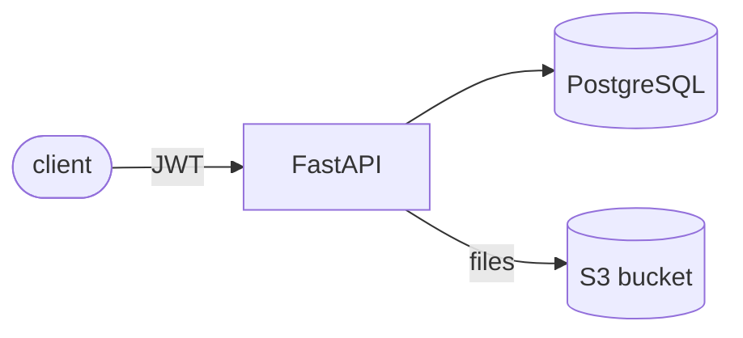

# Project Hub

Project management REST API — create projects, attach documents (pdf/docx)
and share them with other users. Built with FastAPI, PostgreSQL and S3.

**Status: in progress.** Auth, projects/permissions and document storage are
done; storage-limit lambda, share-by-email and the CI/CD pipeline are next
(see [roadmap](#roadmap)).

## Features

- User registration and login with JWT authentication (1-hour tokens,
  bcrypt password hashing)
- Projects with two access levels: **owner** (full control) and
  **participant** (can view and modify, cannot delete or invite)
- Documents stored in S3 (emulated locally with LocalStack), metadata in
  PostgreSQL — only pdf and docx are accepted
- 43 automated tests

## Architecture



Postgres stores the facts (users, projects, memberships, document
metadata); S3 stores the file bytes under `projects/{project_id}/...`
keys. Permissions resolve in FastAPI dependencies before any endpoint
logic runs.

## Getting started

Requirements: Python 3.12+, [Poetry](https://python-poetry.org/), Docker.

Start the infrastructure (postgres + LocalStack, bucket created
automatically):

```bash
docker compose up -d
```

Install dependencies and apply migrations:

```bash
poetry install
poetry run alembic upgrade head
```

Run the API:

```bash
poetry run uvicorn app.main:app --reload
```

Interactive docs at http://localhost:8000/docs. Configuration is read from
`.env` — see `.env.example` for the available variables (the defaults work
out of the box against the compose stack).

## Demo

An end-to-end walkthrough (two users, permissions, upload/download against
real S3) — interactive, press Enter between steps:

```bash
bash scripts/demo-flow.sh          # step by step
bash scripts/demo-flow.sh --fast   # no pauses
```

## API

| Method | Path                         | Who can call it        |
| ------ | ---------------------------- | ---------------------- |
| POST   | `/auth`                      | public                 |
| POST   | `/login`                     | public                 |
| GET    | `/me`                        | any authenticated user |
| POST   | `/projects`                  | any authenticated user |
| GET    | `/projects`                  | returns your projects  |
| GET    | `/project/{id}/info`         | owner or participant   |
| PUT    | `/project/{id}/info`         | owner or participant   |
| DELETE | `/project/{id}`              | owner                  |
| POST   | `/project/{id}/invite?user=` | owner                  |
| GET    | `/project/{id}/documents`    | owner or participant   |
| POST   | `/project/{id}/documents`    | owner or participant   |
| GET    | `/document/{id}`             | owner or participant   |
| PUT    | `/document/{id}`             | owner or participant   |
| DELETE | `/document/{id}`             | owner or participant   |

## Running tests

Tests need the database container running (they use a separate
`projecthub_test` database, created automatically by the compose setup):

```bash
poetry run pytest
```

S3 is replaced with an in-memory fake in the tests; the real integration
is exercised by the demo script against LocalStack.

## Roadmap

- [ ] Lambda triggered by S3 events to compute per-project storage usage
      and enforce a size limit
- [ ] Share projects by email (signed join links)
- [ ] Coverage gate and tox
- [ ] Dockerfile + CI/CD pipeline (tests, build, publish image)
